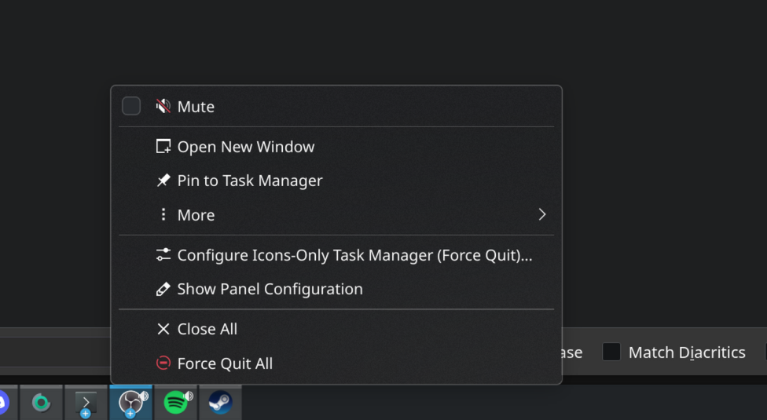

# KDE Plasma Taskbar "Force Quit" Context Menu Option



> **WARNING**: This project is still a WIP and is not working as intended or very buggy as you're reading this. Use at your own risk.

> 💡 **Note**: This project was vibe-coded using Google Gemini, based on the implementation discussed in [this KDE discuss thread](https://discuss.kde.org/t/qml-changing-the-taskbar-context-menu-close-button-to-kill-the-app/43752/7).

Adds a **Force Quit** (or **Force Quit All** for grouped windows) option to the right-click context menu of applications in the KDE Plasma 6 taskbar.

This is implemented as two custom, user-space widgets:

1. **Icons-Only Task Manager (Force Quit)**
2. **Task Manager (Force Quit)**

These widgets clone the default Plasma 6 Task Managers but inject an asynchronous **Force Quit** action using the `plasma5support` module's `"executable"` engine to run `kill -9` on the target application's Process ID(s).

---

## Installation

### Quick Install (Remote via Curl)

To download, install both custom widgets, and reload the widget cache, run:

```bash
curl -fsSL https://raw.githubusercontent.com/anthonymendez/Right-Click-Force-Quit-on-KDE-Plasma-Task-Manager/main/install.sh | bash
```

### Manual Install (Local Repo Clone)

If you have cloned the repository locally, run:

```bash
./install.sh
```

---

## Enabling the Custom Widgets

Once installed, you must replace the default taskbar widgets with the custom ones on your desktop panel:

1. Right-click your current panel (the taskbar) and select **Enter Edit Mode** (or **Edit Panel**).
2. Hover over the existing taskbar widget and click the **Remove** (trash can) button to delete it.
3. Click the **Add Widgets...** button at the top/side of your screen.
4. Search for `Force Quit`.
5. Drag **Icons-Only Task Manager (Force Quit)** (or **Task Manager (Force Quit)**) and drop it onto the panel where your old task manager was.
6. Exit Edit Mode.

---

## How It Works

- **QML Custom Module Import**: Because the system's backend is compiled in C++, our custom QML widgets globally import `plasma.applet.org.kde.plasma.taskmanager` and `org.kde.taskmanager` to access the C++ window list model.
- **Context Menu Modification**: Patches `ContextMenu.qml` to inject the `forceQuitItem` below the standard "Close" option.
- **PID Resolution**:
  - For single tasks, it queries the `AppPid` role.
  - For grouped tasks, it iterates through child windows using `TaskManagerApplet.TaskTools.foreachChildTask` to gather all active process IDs.
- **Asynchronous Termination**: Runs `kill -9 <PID>` asynchronously from QML using the `Plasma5Support.DataSource` engine.

---

## Updating from Upstream KDE

If you upgrade your KDE Plasma version and want to update the cloned widgets to match the latest upstream task manager code (while keeping the Force Quit feature intact), run:

```bash
./update-project-kde-taskbar.sh [version]
```

- If you don't pass a version (e.g. `6.7.1`), it will automatically detect your currently running `plasmashell` version.
- The script clones `plasma-desktop`, checks out the target release tag, copies all necessary files into the project, and automatically applies the patch located in `patches/force-quit.patch`.
- After updating, run `./install.sh` to redeploy.

---

## Uninstallation

To completely remove the custom widgets:

```bash
rm -rf ~/.local/share/plasma/plasmoids/org.kde.plasma.icontasks.custom
rm -rf ~/.local/share/plasma/plasmoids/org.kde.plasma.taskmanager.custom
systemctl --user restart plasma-plasmashell
```

Then re-add the default task managers to your panel via Edit Mode.
